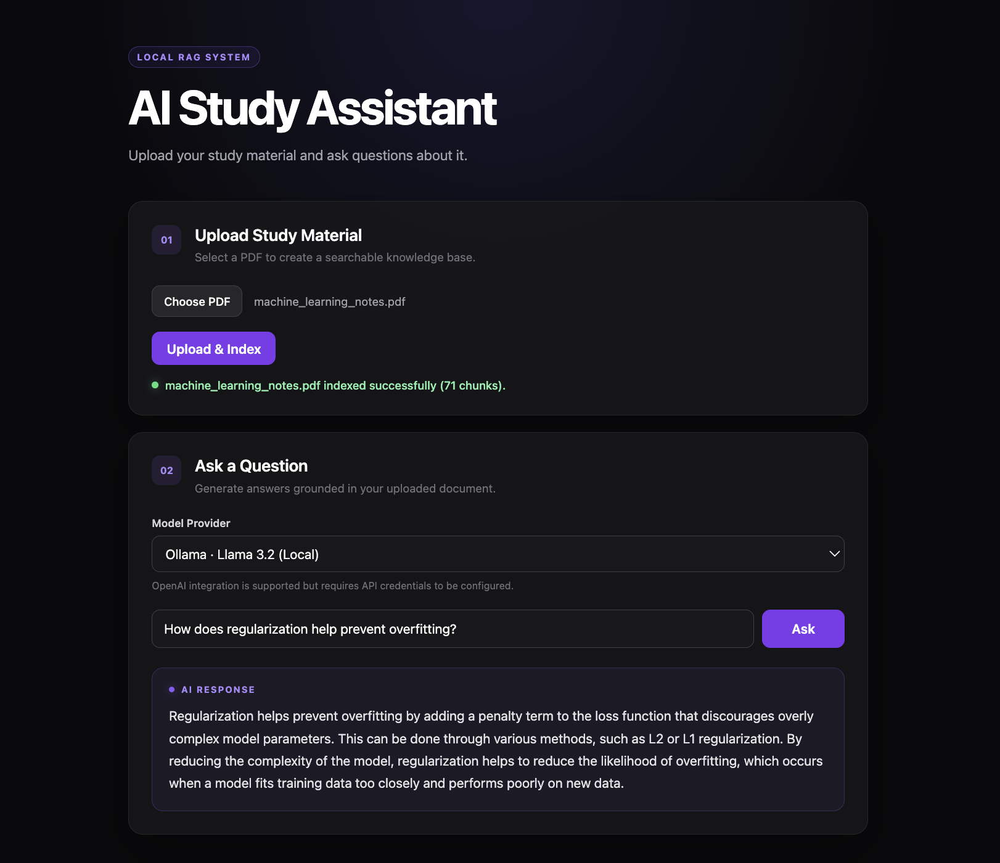

# AI Study Assistant

A full-stack Retrieval-Augmented Generation (RAG) prototype for asking natural-language questions about uploaded PDF documents. The project combines a React/Vite frontend with a FastAPI backend, semantic retrieval using SentenceTransformers + FAISS, and interchangeable LLM providers.

The default demo runs fully locally with Ollama and Llama 3.2. OpenAI integration is implemented behind the same provider interface and can be enabled by supplying API credentials.

## Demo



The interface allows users to upload and index a PDF, select an available LLM provider, submit natural-language questions, and receive responses grounded in retrieved document context.

## Features

* React + Vite frontend with responsive dark-mode UI
* PDF upload and indexing workflow
* PDF text extraction with PyMuPDF
* Overlapping document chunking
* SentenceTransformers embeddings using `all-MiniLM-L6-v2`
* FAISS cosine-similarity retrieval
* Retrieval-Augmented Generation (RAG)
* FastAPI REST endpoints with Swagger/OpenAPI documentation
* Local inference with Ollama + Llama 3.2 1B
* Optional OpenAI provider through a shared provider abstraction
* Loading, success, error, and document-ready UI states
* Configurable frontend API endpoint through environment variables

## Architecture

```text
Browser
  |
  v
React + Vite (localhost:5173)
  |
  | POST /upload, POST /ask
  v
FastAPI (127.0.0.1:8000)
  |
  +--> PyMuPDF text extraction
  +--> Document chunking
  +--> SentenceTransformers embeddings
  +--> FAISS cosine-similarity retrieval
  |
  v
LLM Provider Interface
  |-- OllamaProvider -> Llama 3.2:1b (default local demo)
  `-- OpenAIProvider -> OpenAI API (optional credentials)
```

The retrieval pipeline is independent of the inference provider, allowing the LLM backend to be changed without rewriting PDF processing, embedding, indexing, or retrieval logic.

## Backend Design

The FastAPI backend is responsible for document ingestion, semantic retrieval, and LLM-based answer generation.

The backend is separated into three primary layers:

* **API layer (`main.py`)** — exposes the `/upload`, `/ask`, and `/health` endpoints and coordinates requests between the frontend and retrieval pipeline.
* **Retrieval layer (`rag.py`)** — handles PDF text extraction, document chunking, embedding generation, FAISS indexing, semantic search, and grounded prompt construction.
* **LLM provider layer (`backend/llm/`)** — defines a common provider interface with interchangeable Ollama and OpenAI implementations.

This separation keeps API handling, retrieval logic, and model inference loosely coupled and easier to extend independently.

## Retrieval-Augmented Generation Pipeline

### 1. PDF Ingestion

Uploaded PDFs are received through the FastAPI `/upload` endpoint.

PyMuPDF extracts text from the uploaded document before the temporary upload is removed.

### 2. Document Chunking

Extracted text is divided into overlapping chunks.

The overlap helps preserve semantic context across chunk boundaries while keeping each retrieval unit small enough for efficient embedding and search.

### 3. Embedding Generation

Each document chunk is encoded using the SentenceTransformers model:

```text
all-MiniLM-L6-v2
```

The resulting dense vector representations capture semantic relationships between passages rather than relying only on exact keyword matching.

### 4. Vector Indexing

Chunk embeddings are normalized and stored in a FAISS vector index.

This enables efficient cosine-style semantic similarity search over the uploaded document.

### 5. Query Retrieval

When a user submits a question, the question is embedded using the same SentenceTransformer model.

FAISS compares the query embedding against the indexed document vectors and retrieves the most semantically relevant chunks.

### 6. Prompt Construction

The retrieved chunks are combined with the user's question to construct a grounded prompt.

The model is instructed to answer using the retrieved document context, reducing reliance on unsupported information outside the uploaded material.

### 7. Answer Generation

The completed prompt is passed to the configured LLM provider.

The default local configuration uses:

* Ollama
* Llama 3.2:1b
* Ollama's local HTTP API

An OpenAI implementation is also available through the same provider interface when API credentials are configured.

## LLM Provider Abstraction

LLM inference is implemented behind a shared provider interface rather than being directly coupled to one model API.

```text
LLMProvider
    |
    +-- OllamaProvider
    |
    `-- OpenAIProvider
```

A provider factory selects the requested implementation at runtime.

The retrieval pipeline therefore interacts with a common generation interface without needing to know whether inference is performed locally through Ollama or through a cloud-based provider.

This design makes additional model providers easier to integrate without modifying document processing, retrieval, or API logic.

## Frontend Design

The frontend is implemented with React and Vite using reusable components:

* **`Header`** — application title and description
* **`UploadPanel`** — PDF selection, upload, indexing state, and success/error feedback
* **`QuestionForm`** — provider selection, question submission, loading state, and answer rendering

Shared document state is managed in `App.jsx`.

The question interface remains disabled until a document has been successfully indexed, preventing requests against an empty retrieval index.

Frontend requests communicate with FastAPI using the browser `fetch` API and `FormData`.

## Tech Stack

**Frontend:** React, Vite, JavaScript, CSS, ESLint
**Backend:** Python, FastAPI, Uvicorn, REST APIs
**RAG / ML:** SentenceTransformers, FAISS, NumPy, PyMuPDF
**LLMs:** Ollama + Llama 3.2:1b, optional OpenAI API
**Development:** Git, npm, Python virtual environments

## Project Structure

```text
AI-Study-Assistant/
├── backend/
│   ├── llm/
│   │   ├── factory.py
│   │   ├── ollama_provider.py
│   │   ├── openai_provider.py
│   │   └── provider.py
│   ├── csc311_study_notes.pdf
│   ├── main.py
│   ├── rag.py
│   ├── requirements.txt
│   └── test_rag.py
│
├── frontend/
│   ├── src/
│   │   ├── components/
│   │   │   ├── Header.jsx
│   │   │   ├── QuestionForm.jsx
│   │   │   └── UploadPanel.jsx
│   │   ├── App.css
│   │   ├── App.jsx
│   │   ├── config.js
│   │   ├── index.css
│   │   └── main.jsx
│   ├── .env.example
│   ├── index.html
│   ├── package.json
│   └── vite.config.js
│
├── docs/
│   └── ai-study-assistant-demo.png
│
├── .gitignore
├── README.md
└── run_backend.sh
```

## Prerequisites

Install:

* Python 3.12+
* Node.js + npm
* Ollama
* Git

Download the default local model:

```bash
ollama pull llama3.2:1b
```

## Setup

### 1. Clone the Repository

```bash
git clone <repository-url>
cd AI-Study-Assistant
```

### 2. Create the Python Environment

```bash
python3 -m venv .venv
.venv/bin/python -m pip install --upgrade pip
.venv/bin/python -m pip install -r backend/requirements.txt
```

### 3. Install Frontend Dependencies

```bash
cd frontend
npm install
cd ..
```

### 4. Optional OpenAI Configuration

Ollama works without cloud credentials.

To enable the OpenAI provider, create a root `.env` file:

```text
OPENAI_API_KEY=your_api_key_here
```

Never commit the `.env` file or an API key to Git.

## Running the Application

The frontend and backend run as separate development services and should be started in two terminals.

### Terminal 1 — Backend

From the project root:

```bash
./run_backend.sh
```

The startup script uses the project's Python virtual environment, starts Ollama if required, and launches FastAPI at:

```text
http://127.0.0.1:8000
```

FastAPI documentation:

```text
http://127.0.0.1:8000/docs
```

Health check:

```text
http://127.0.0.1:8000/health
```

### Terminal 2 — Frontend

```bash
cd frontend
npm run dev
```

Open:

```text
http://localhost:5173
```

## API Endpoints

| Method | Endpoint  | Purpose                                                 |
| ------ | --------- | ------------------------------------------------------- |
| `GET`  | `/health` | Backend health check                                    |
| `POST` | `/upload` | Upload, parse, embed, and index a PDF                   |
| `POST` | `/ask`    | Retrieve relevant chunks and generate a grounded answer |

### `/upload`

The upload endpoint:

1. receives a PDF;
2. extracts its text;
3. divides the text into overlapping chunks;
4. generates semantic embeddings;
5. builds the FAISS vector index;
6. returns indexing information to the frontend.

### `/ask`

The question endpoint:

1. receives the user's question and selected provider;
2. embeds the question;
3. retrieves relevant document chunks;
4. constructs the RAG prompt;
5. selects the requested LLM provider;
6. generates and returns the answer.

## Frontend Configuration

The frontend defaults to:

```text
http://127.0.0.1:8000
```

To use another backend URL, copy:

```text
frontend/.env.example
```

to:

```text
frontend/.env
```

and configure:

```text
VITE_API_BASE_URL=http://127.0.0.1:8000
```

## Demo Document

`backend/csc311_study_notes.pdf` is included as a reproducible example document.

The application can also process other text-based PDF documents through the upload interface.

## Current Scope

This repository is intentionally a portfolio prototype rather than a production SaaS application.

In its current form:

* one uploaded document is kept in memory at a time;
* the FAISS index is not persisted after the backend stops;
* the local 1B model prioritizes lightweight runtime over maximum answer quality;
* OpenAI support requires a locally configured API key;
* authentication and user accounts are outside the current scope;
* chat history is not persisted;
* multi-document workspaces are not implemented.

These constraints keep the project focused on demonstrating full-stack development, RAG architecture, semantic retrieval, API integration, modular software design, and provider abstraction.

## Development Checks

### Frontend Lint

```bash
cd frontend
npm run lint
```

### Frontend Production Build

```bash
npm run build
```

### Command-Line RAG Test

From the repository root:

```bash
python backend/test_rag.py
```

## Security Notes

* API credentials belong in environment variables, never frontend source code.
* `.env` files are excluded from version control.
* Python virtual environments are not committed.
* `node_modules` and frontend build output are excluded from Git.
* Runtime logs, generated uploads, caches, and operating-system metadata are ignored.
* CORS is limited to the local Vite development origins used by this prototype.
